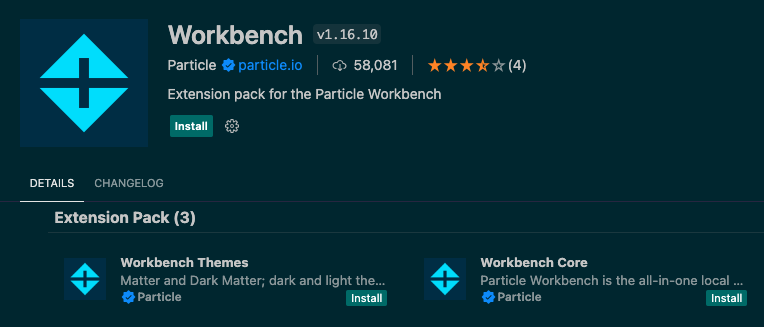
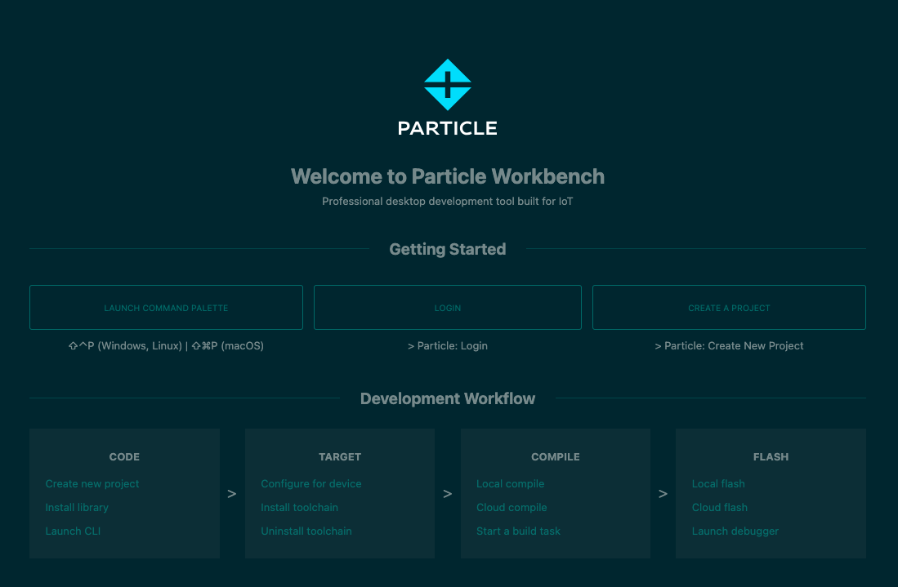
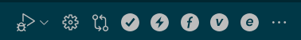
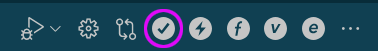

## `Photon 2 / P2` Getting Started: Installing Particle Workbench + VS Code

#### Opening the box

1. Open your Photon 2 box and take the device out.  
1. If you are connecting the photon2 to the breadboard, loosen the anti-static foam from the pins, and press the device into the breadboard to straddle the two sets of rails.
1. Connect the device to your computer via the micro-USB port.
1. [set up a new Particle.io account](https://particle.io/signup) with your information and have a login. 
1. [set up a new device in your Particle.io console](https://setup.particle.io/)
1. [register and set up your *Photon 2* device](https://setup.particle.io/) with the Particle.io platform, associated with said account (note that the [Chrome browser](https://www.google.com/chrome/) is required).
1. gotten your *Photon 2* registered on the UC Berkeley IoT network, including the acquisition of your MAC address and the [addition of your device to the IoT network](https://portal.berkeley.edu/people/wifi_access).  If you have not, please do so based on the instructions found in [this tutorial](https://github.com/Berkeley-MDes/tdf-fa23-equilet/blob/main/_iot_network_tutorial/README.md)

...if you've completed the tasks outlined above, please proceed!

***Note:*** if you just want to restore your device to a known good state, you can use [this link](https://docs.particle.io/tools/device-restore/device-restore-usb/)

---

#### Installing VS Code 

</img>

Let's install Microsoft's Visual Studio Code (VS Code) integrated development environment (IDE).  We chose this environment because it...

- is cross platform
- integrates all manner of codebases and programming paradigms into a single environment
- is an industry standard at the moment
- allows you to utilize [Github Copilot](https://github.com/features/copilot), an AI agent for generating code based on textual prompts
- is the recommended method with which to build firmware using Particle.io, using the [Particle Workbench](https://www.particle.io/workbench/) extension

1. Navigate to [the Visual Studio Code download page](https://code.visualstudio.com/Download) and download the software pertaining to your operating system.

1. Open the software application.  You'll notice that there is a sidebar on the left that displays options for selection.  This is the _Extensions_ pane, meant for extending the Visual Studio code IDE.  It looks like this: 
</img>

1. Click on this icon to expose the Extensions pane.  You'll note that your cursor pops into a field where you can search.

---

#### Installing particle workbench extension

1. Search for "Particle Workbench".  A number of extensions pop up in the results.  The one we want to install is called "Workbench".  This [Extensions] view might display other Particle extensions, some of which are related to the workbench.  You can ignore them.

1. Click on the **Workbench** extension, and you'll see it pop up in a new tab to the right of the sidebar.  
</img>

1. Click on **Install** to install the extension.  This may take some time, depending on your internet connection.  You may also be prompted to install Command Line tools associated with features that the Particle Workbench needs.  Go ahead and say "yes" to these subsequent installations.  They are required for the Workbench to function.  

***Note:***  If you are _not_ prompted to install the Particle CLI tools, you can force them to install by clicking on the Particle Workbench extension home page, then clicking on [Launch CLI] for the first time, which prompts the workbench.

#### Supplementary: Installing Microsoft's Serial Monitor extension

The Particle Workbench should install a utility for monitoring the serial port.  In some edge cases, you may find that there is no serial monitor installed.

- To test, try typing `ctrl-shift-P`, and entering "serial".  
- If a serial monitor is present, you'll see it pop up in the results of the command palette
- If not, we'll need to install one.  Microsoft distributes an extension for just that.  See below:

1. Click on the **Extensions** panel again.  It looks like this: 
</img>

1. Search for "serial monitor".  There will be a Microsoft extension that shows up.  This is the one you want.  It looks like this: 
</img>

1. Click on **Install** to install the extension. 
</img>

---

#### Sign in to Particle Workbench

1. Now that you've installed the Particle Workbench, you will see its icon in the left sidebar.  It looks like this: 
</img>

1. Click on the extension to reveal the main Workbench page. 
</img>

1. ***Note:*** There are three **Getting Started** sections of this area.  "Launch Command Palette", "Login", and "Create a Project".  We'll go through each in succession to build and flash our first project, including some extra details that may not be covered by default.

1. Now that you are in the workbench, 

---

#### Login

Click on `Login` in order to type your username and password info associated with your Particle device.  The prompts will lead you through the process.  This will log you in and allow your device to be recognized as you flash code over USB or WiFi.

***Note:*** You can verify that you are logged in by typing `particle whoami` into a terminal within VS Code.  If logged in, your username/email should print.

#### Creating your first Project

Click on `Create a Project`.  This will generate all of the necessary files on disk for you to build a project in VS Code and start using the Workbench system.  You'll note that once you do this, the boiler plate `setup()` and `loop()` functions are bare, as it is expected that you've seen these things before (which is why we made sure about this before commencing!).

_Things to make sure of:_

1. At the bottom of the Workbench screen, choose device os 5.8.0 
</img>

1. In that same area (This tab initially reads `Argon` as of September 2024), choose your device type (make sure it reads `Photon 2 / P2`) 
</img>

1. In the area where it says `<select device>`, enter in device name or id (this is the name of the device that you created when you initiated in `setup.particle.io`) 
</img>

1. If it is not already, connect the photon2 to the computer
    - plug the micro-usb cable into the photon's usb port
    - plug the other end of the cable to your computer

1. You will notice that an LED illuminates.  This is a multi-colored LED that relays status when the device is powered.  It  will tell you whether your photon2 has a particular issue, if it is connected to a wifi network, and many other modes.  You can view all the modes [here](https://docs.particle.io/troubleshooting/led/).

***Note:*** The usb cable you use is going to depend on your computer that you connect to the photon2 with.  If you have a Type A port, you'll need a type a to micro cable.  If you have a Type C port, you'll need a type C to micro cable, etc.

#### Command Palette

The command palette allows you to execute commands associated with VS Code and the Particle Workbench.

- You focus the command palette with the key combo:  `⇧⌃P (Windows, Linux) | ⇧⌘P (macOS)`.  This key command focuses the cursor to the palette. 
- Type `Particle: XXXX`, where `XXXX` represents the command in Particle Workbench you would like to execute.  

We don't need this to get started, but keep it in mind as you start to familiarize yourself with the envionment.  It can make the process of finding things quicker.

#### Verification, Compilation, Flashing

To verify and compile our code, we need to click on the light grey checkbox.  It is located in the top-right menubar of the particle workbench, but is _only_ visible if you are selected inside of a Particle Workbench `.cpp` file. Here is an overview of creating a new project and flashing for the first time.

To do this, follow the steps outlined below:

1. Assuming you have a project loaded, you can click on the explorer icon.  It looks like this: 
</img>

1. Once in the explorer, you'll see a number of items including 
  - `.github`
  - `.vscode`
  - `src`
  - `.gitignore`
  - `project.properties`
  - `README.md` 

  ...The one we're interested in is `src`, and stands for _source code_.

1. Click on `src` to expose a file of interest:  `<yourfilename>.cpp`.  

1. Click on the `.cpp` file to display its contents.  
  - You are now in the "coding" area of the Particle Workbench project.
    - This is the main file we'll concern ourselves with when writing firmware code to flash the photon2 with.  
    - Note that there is a special menubar that appears at the top-right of the screen.  
      - This contains the buttons you'll need to compile and flash your code.  
</img>

1. Click on the small grey checkbox located in this menubar. 
</img>

1. If the compilation was successful you will see the following in the Terminal: `*** COMPILED SUCCESSFULLY ***`.  
  - Success!

***Note:*** compilation can take some time.  Please be patient with the process, which is dependant on a number of factors including whether it is the first time you've compiled this code, if you need to download elements, if you are running Particle Workbench on a slower computer, etc. 

***Note:*** Your compilation may have errors.  If it does, please report them to one of your professors and/or TA so that we can assist you in the process of debugging.  

#### Flashing your code to the Photon 2 

Now that we have compiled our code, we are ready to flash it to our microcontroller.  This is done by clicking a different button in the menubar, which looks like a lightning bolt. 
</img>

1. Click the lightning bolt

1. Wait for some time 

1. If the flash is successful, you will see the microcontroller's status LED blinking through various colors and associated patterns.  If the flash was successful, you'll see the following in the Terminal: `*** FLASHED SUCCESSFULLY ***`.  

More success!  You're done!

---
