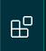
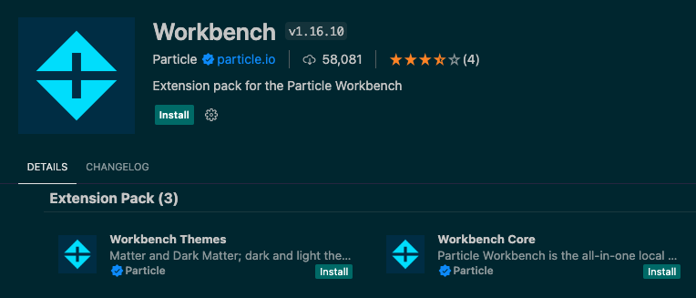
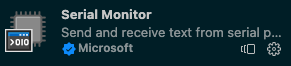
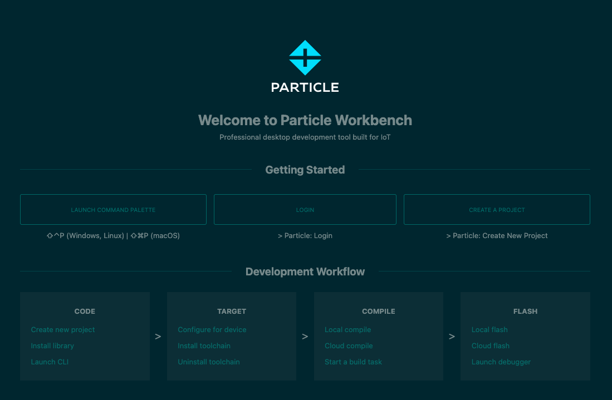
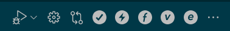

## Installing Particle Workbench and VS Code

#### This installation tutorial assumes that you have done the following:

1. [set up a new Particle.io account](https://particle.io/signup) with your information and have a login. 
1. [registered and set up your *Photon 2* device](https://setup.particle.io/) with the Particle.io platform, associated with said account.
1. get your *Photon 2* registered on the UC Berkeley IoT network, including the acquisition of your MAC address and the [addition of your device to the IoT network](https://portal.berkeley.edu/people/wifi_access).  If you have not, please do so based on the instructions found in [this tutorial](https://github.com/loopstick/Photon2_Tutorial/#2-configure-wi-fi-do-this-at-home)
1. compiled and flashed code to your *Photon 2* device, have experimented with making modifications in the Particle Web IDE, and have begun breadboarding with follow-along tutorials.  If you have not experimented with this, please go through the tutorial found [here](https://github.com/loopstick/Photon2_Tutorial/#7-hello-world---is-this-thing--on).

...if you've completed the tasks outlined above, please proceed!

---

#### Installing VS Code 

</img>

We are going to install Microsoft's Visual Studio Code (VS Code) integrated development environment (IDE).  This will allow us to integrate lots of other types of code outside of the Particle.io environment into the projects we are working on, and to explore alternate codebases that may intersect with what we're already doing with the Photon 2.  

It will also allow us to utilize the Particle.io platform within VS Code, which we will cover later.

1. Navigate to [the Visual Studio Code download page](https://code.visualstudio.com/Download) and download the software pertaining to your operating system.

1. Open the software application.  You'll notice that there is a sidebar on the left that displays options for selection.  This is the *Extensions* pane, which allows you to install extended portions of functionality into the Visual Studio code IDE.  It looks like this: 
</img>

1. Click on this icon to expose the Extensions pane.  You'll note that your cursor pops into a field where you can search.

---

#### Installing particle workbench extension

1. Search for "Particle Workbench".  You'll note that a number of extensions pop up in the results.  The one that we will be installing is called "Workbench".  This includes some of the others that are displayed under a single installation.  

1. Click on the **Workbench** extension, and you'll see it pop up in a new tab to the right of the sidebar.  
</img>

1. Click on **Install** to install the extension.  This may take some time, depending on your internet connection.  You may also be prompted to install Command Line tools associated with features that the Particle Workbench needs.  Go ahead and say "yes" to these subsequent installations.  They are required for the Workbench to function.

#### Installing Serial monitor extension

We will need a serial monitor to verify that things are working in this tutorial.  This will allow us to print a "Hello World"-style output from the serial output of the device via USB.  

1. Click on the **Extensions** panel again.  It looks like this: 
</img>

1. Search for "serial monitor".  There will be a Microsoft extension that shows up.  This is the one you want.  It looks like this: 
</img>

1. Click on **Install** to install the extension. 
</img>

---

#### Sign in to Particle Workbench

1. Now that you've installed the Particle Workbench, you will see its icon in the left sidebar.  It looks like this: 
</img>

1. Click on the extension to reveal the main Workbench page. 
</img>

1. Note that there are three **Getting Started** sections of this area.  "Launch Command Palette", "Login", and "Create a Project".  We'll go through each in succession to build and flash our first project, including some extra details that may not be covered by default.

---

#### Login

Click on `Login` in order to type your username and password info associated with your Particle device.  The prompts will lead you through the process.  This will log you in and allow your device to be recognized as you flash code over USB or WiFi.

#### Creating a Project

Click on `Create a Project`.  This will generate all of the necessary files on disk for you to build a project in VS Code and start using the Workbench system.  You'll note that once you do this, the boiler plate `setup()` and `loop()` functions are bare, as it is expected that you've seen these things before (which is why we made sure about this before commencing!).

_Things to make sure of:_

1. At the bottom of the Workbench screen, choose device os 5.5.0 
</img>

1. In that same area, choose your device type (make sure it reads `Photon 2 / P2`) 
</img>

1. enter in device name or id (this is the name of the device that you created when you initiated in `setup.particle.io`) 
</img>

#### Command Palette

Although listed first, the command palette is what we'll cover last.  It allows you to execute commands associated with VS Code, and if you click this it will display everything associated with the Particle Workbench.  There is a key command for this as well:  `⇧⌃P (Windows, Linux) | ⇧⌘P (macOS)`.  You'll note that you can type this key command to move the cursor to the palette and type `Particle: XXXX`, where `XXXX` represents the command in Particle Workbench you would like to execute.  We don't need this to get started, but please keep it in mind as you advance to building and flashing your code here.

#### Verification, Compilation, Flashing

To verify and compile our code, we need to click on the light grey checkbox.  It is located in the top-right menubar of the particle workbench, but is _only_ visible if you are selected inside of a PW `.ino` file.  Go back a few steps and either create a new project, or select the project via the VS Code explorer.  

To do this, follow the steps outlined below:

1. Assuming you have a project loaded, you can click on the explorer icon.  It looks like this: 
</img>

1. Once in the explorer, you'll see a number of areas including `OPEN EDITORS`, `PARTICLE_BASIC`, `src`, and `target`.  The one we're interested in is `src`, and stands for _source code_.

1. Click on `src` to expose two files of interest:  `<yourfilename>.cpp` and `<yourfilename>.ino`.  

1. Click on the `.ino` file to display its contents.  You are now in the "building" area of the Particle Workbench.  Note that there is a special menubar that appears at the top-right of the screen.  This contains the buttons you'll need to compile and flash your code.  
</img>

1. Click on the small grey checkbox located in this menubar. 
</img>

1. If the compilation was successful you will see the following in the Terminal: `*** COMPILED SUCCESSFULLY ***`.  Success!

**Note1:** compilation can take some time.  Please be patient with the process, which is dependant on a number of factors including whether it is the first time you've compiled this code, if you need to download elements, if you are running Particle Workbench on a slower computer, etc.* 

**Note2:** Your compilation may have errors.  If it does, please report them to one of your professors and/or TA so that we can assist you in the process of debugging.  

#### Flashing your code to the Photon 2 

Now that we have compiled our code, we are ready to flash it to our microcontroller.  This is done by clicking a different button in the menubar, which looks like a lightning bolt. 
</img>

1. Click the lightning bolt

1. Wait for some time 

1. If the flash is successful, you will see the microcontroller's status LED blinking through various colors and associated patterns.  If the flash was successful, you'll see the following in the Terminal: `*** FLASHED SUCCESSFULLY ***`.  

More success!  You're done!

**Note** *that flashing can take some time.  Please be patient with the process, which is dependant on a number of factors including your internet connection speed, your computer's age, whether you are running Particle Workbench on a slower computer, etc.*

---

At this point you can start to migrate code that you've been working on in the Web IDE over to this platform and experimenting with your new environment, using some of the Particle-specific commands, etc.  There are many things you can do here that you don't have access to in the Web IDE.  Have fun!
