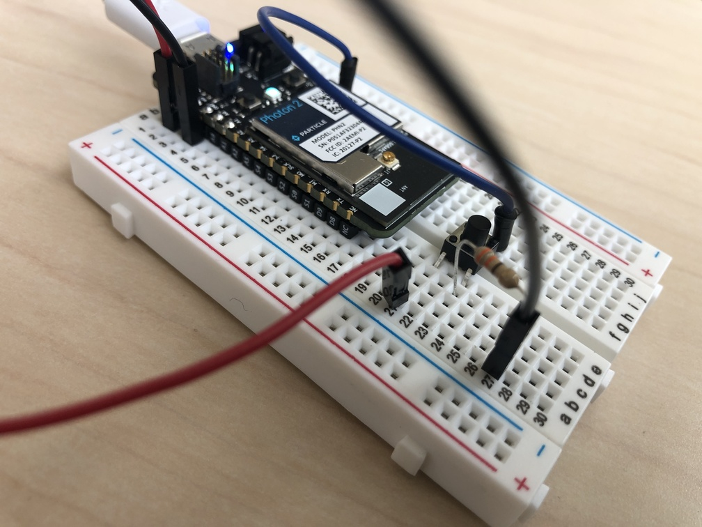
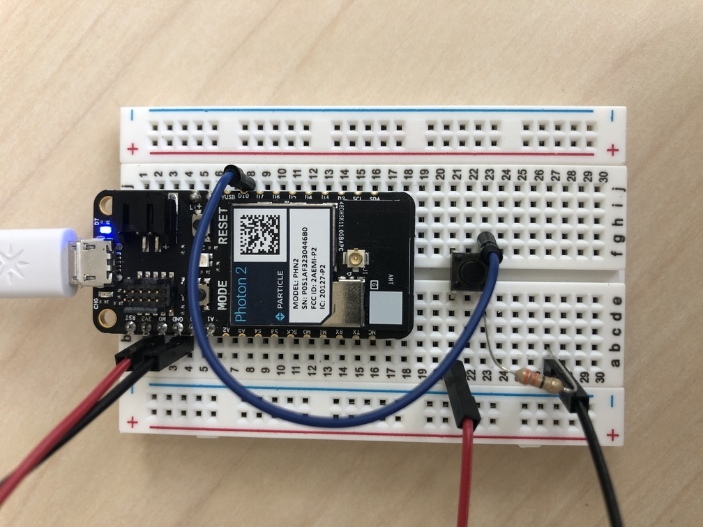

## basic button send-on-change example



---

### Goal of Project 

*Send a button's value to the web _only_ when it changes, using a comparison in the main loop of our code*

We will read a pin on the photon 2 microcontroller at a very fast rate, yielding a `HIGH` or `LOW` value.  If that state changes (when the physical button is pressed), we want to send this value to the Particle.io cloud...  But not as frequently as every execution of the loop!  The key here is to understand that inside of the `loop()` function, our code is evaluated at a fast periodicity, and that if we want other processes to be evaluated via a different *schedule*, we need to handle this in the code.  You can consider that we might not always perform operations within this "clock structure", but that we are subject to it in the loop (i.e., when we do choose to initiate an event we do it a clock tick).  Our example code operates every *100ms*.  One might at times consider using an [interrupt](https://docs.particle.io/reference/device-os/api/interrupts/interrupts/) for a similar process, but this is a slightly different idea.

#### This project demonstrates the following:

1. how to write code with the "Device OS" Particle.io operating system (microcontroller-based) that takes input, processes it, and passes the processed data to an output to yield actuation
1. how to catch a condition within a `loop()` function and conditionally execute on a schedule
1. how to send a value to the Particle.io cloud system via `Particle.publish()`

---

### Documentation: 

The circuit is powered over 3.3V from the microcontroller, which can be supplied via a usb power adapter, a lipo battery, or your computer's usb port.

send-on-change top | send-on-change fritzing
---|---
 | 

### Steps to recreate circuit:

**Note** that in the fritzing file, we use a 330 ohm resistor.  If you do not have this exact value, feel free to use a 220 ohm, or something else nearby this value.

Photon 2 connections (feel free to follow these or just copy from the diagram):

1. push your Photon 2's pins into a mini (or regular) breadboard so that it straddles the two sides.  Note that one of the sides will have more pins left on the relevant rails than the other.  This is fine.  Also note that if you position the device towards the top of the board it's easier to plug in the micro-USB cable.  
1. push your button into an an area where it straddles both middle rail sets.
1. connect a lead from the 3.3V pin of the photon2 to the top-left leg of the button via the middle rail
1. connect a lead from the GND pin on the photon2 to an open middle rail on your breadboard.

Button connections:

1. wire a resistor from a pin on the GND rail to a pin that touches the bottom-left leg of the button
1. wire a lead from a pin that touches the bottom-right leg of the button to D10 
1. wire a lead from a pin that touches the bottom-left leg of button to your resistor rail

**Note:** some of the pins that are referred to in these steps have special purposes depending on the application.  Please refer to the [Photon 2 pin marking diagram](https://docs.particle.io/reference/datasheets/wi-fi/photon-2-datasheet/#pin-markings) located in the [photon 2 datasheet](https://docs.particle.io/reference/datasheets/wi-fi/photon-2-datasheet/) page on the [Particle.io reference](https://docs.particle.io/reference/) website for more information.  For this demonstration we manipulate pin configurations in the `setup()` function of the code.

---

### Steps to replicate software environment

**Note:** *We assume that you have installed Particle Workbench inside of Visual Studio Code, and are familiar with the process of selecting your device.*  If not, see [this tutorial](https://github.com/Berkeley-MDes/tdf-fa23-equilet/blob/main/_pw_tutorial/README.md).

1. download the project files 
1. open the folder this README resides within in Visual Studio Code
1. select your particle device OS
1. select your particle device type
1. select your particle photon 2 device either by device name or ID
1. verify/compile
1. flash the code to your photon2 

#### Code (represented in project):

```
int button = D10; // button leg is connected to D10
int ledpin = D7;  // onboard LED is normalled to D7
const char *be = "button_event"; //the name of our published event
volatile int state = 0;
volatile int state_was = 0;

SYSTEM_THREAD(ENABLED); //this will allow the device to connect to the cloud while in setup()
 
void setup(void) {
  Serial.begin(9600);   // We'll send debugging information via the Serial monitor
  pinMode(ledpin, OUTPUT); // sets pin as output
  pinMode(button, INPUT_PULLDOWN); // sets pin as input; defaults to low state
}

//the fast stuff
void loop(void) {
  state = digitalRead(button);
  digitalWrite(ledpin, state); // sets the LED on, which can operate more frequently 
  String state_str = String(state);

  //only send on change (avoid spamming the cloud)
  if(state == 1 && state_was == 0) {
    Particle.publish(be, state_str, PRIVATE);
    Serial.printf("state: %d\n", state);
  } 
  //only send on change (avoid spamming the cloud)
  if(state == 0 && state_was == 1) {
    Particle.publish(be, state_str, PRIVATE);
    Serial.printf("state: %d\n", state);
  }

  state_was = state;
  delay(100);
}
```

---

### To use

1. press the button
1. view the updated value in the [particle cloud console](https://console.particle.io/)