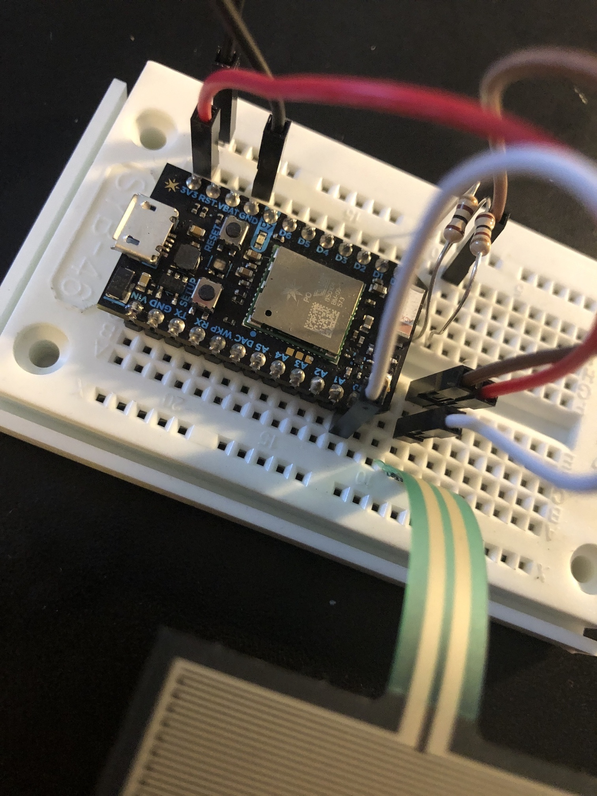

https://build.particle.io/build/64b8796251b7b00017ec06ab

## Basic FSR (Force Sense Resistor) interface demo

FSR init file [particle.io ino](https://build.particle.io/build/64b8796251b7b00017ec06ab)

[shareable link to ino file](https://go.particle.io/shared_apps/64dfed9a18aef9001768ee5e)

### Goal of Project 

The purpose of this tutorial is to get you started from ground zero with the Particle.io platform.

The FSR tutorial shows you some introductory information about a few key topics:

1. how to write basic code with the "Device OS" Particle.io operating system (microcontroller-based)
1. how to connect some leads, an FSR sensor, and your photon2 microcontroller to a breadboard in order to make a basic circuit.  Use Device OS code to read in this sensor value and publish it to the cloud via Particle.publish()
1. how to utilize the online web ide to work with the Device OS and consider options for future tests

