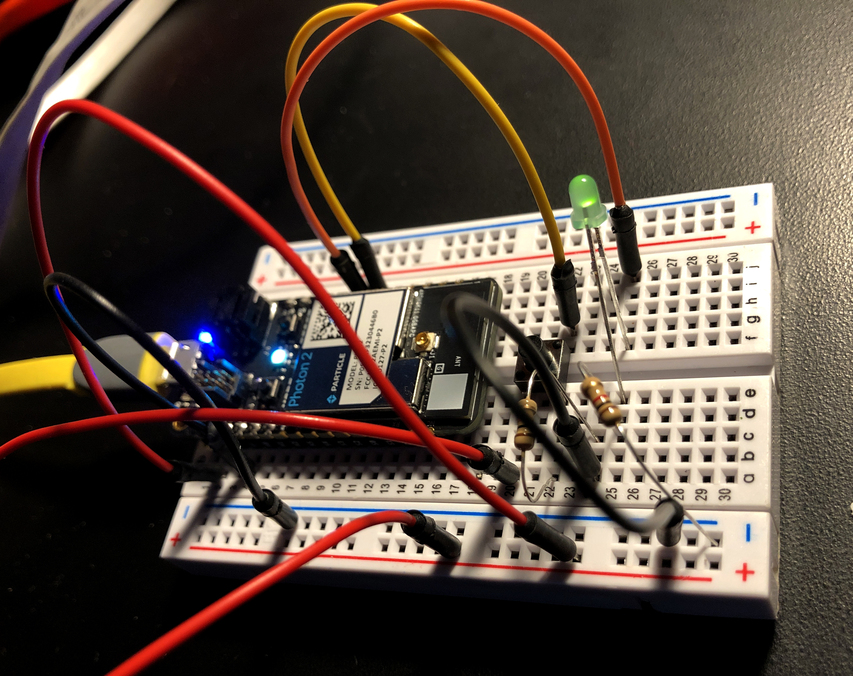
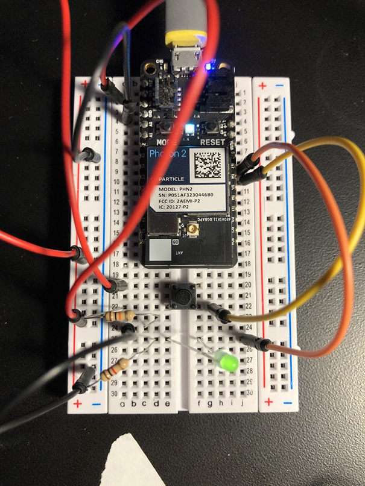
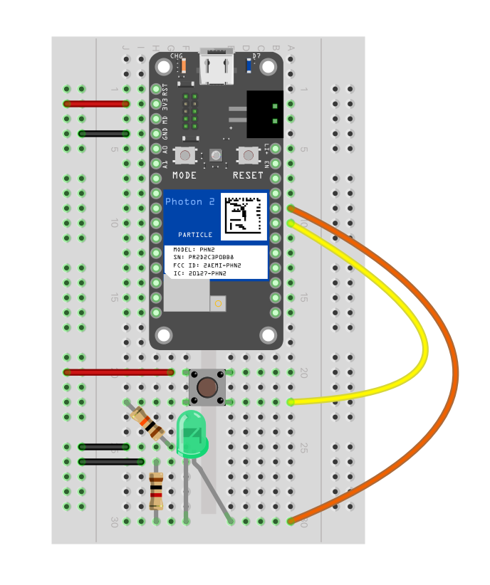

## button -> led pulse rate



---

### Goal of Project 

*Press a button (momentary switch) multiple times to alter how quickly an LED is flashing*

We will use some standard components to perform this exercise.  The action of you pressing a button will alter a variable in the code running on the microcontroller, which will in turn change how rapidly the LED flashes.  This is accomplished via what is called an "interrupt function".  Not all pins can operate as interrupts, so we'll choose our pins for i/o carefully.  Refer to the [Photon 2 pin marking diagram](https://docs.particle.io/reference/datasheets/wi-fi/photon-2-datasheet/#pin-markings) located in the [photon 2 datasheet](https://docs.particle.io/reference/datasheets/wi-fi/photon-2-datasheet/) page on the [Particle.io reference](https://docs.particle.io/reference/) website.  We'll also use a couple of resistors for the LED and one of the button's legs.

#### This project demonstrates the following:

1. how to write code with the "Device OS" Particle.io operating system (microcontroller-based) that takes input, processes it, and passes the processed data to an output to yield actuation
1. how to connect an LED component, a button component, and your photon2 microcontroller together via a breadboard with leads.  
1. how to use DeviceOS's `attachInterrupt()` function

---

### Documentation: 

The circuit is powered over 3.3V from the microcontroller, which can be supplied via a usb power adapter, a lipo battery, or your computer's usb port.

button/led top | button/led fritzing
---|---
 | 

### Steps to recreate circuit:

Photon connections:

1. push your Photon 2's pins into a mini (or regular) breadboard so that it straddles the two sides.  **Note** that one of the sides will have more pins left on the relevant rails than the other.  This is fine.  Also **note** that if you position the device towards the top of the board it's easier to plug in the micro-USB cable.  
1. connect a lead from the 3.3V pin of the photon 2 to the +V (red) rail of your breadboard
1. connect a lead from the GND pin of the photon 2 to the GND (blue) rail of your breadboard

Button connections: 

1. connect a lead from the +V rail to the top-left (see diagram) leg of the button
1. connect a lead from the GND rail to an open middle rail on your breadboard, then connect one leg of a 10K ohm resistor to this rail.
1. connect the other leg of the 10K ohm resistor to the bottom-left leg of the button
1. connect the bottom-right leg of the button to pin D6

LED connections:

1. connect a lead from the GND rail to an open middle rail on your breadboard, then connect one leg of a 1K ohm resistor this rail.
1. connect the other leg of the 1K ohm resistor to the shorter leg of an LED via this middle rail
1. connect the longer leg (positive) of the LED to an open middle rail on the opposite side of the breadboard
1. connect a lead from this middle rail to pin D7 on your Photon 2 via the associated middle rail.

---

### Steps to replicate software environment

**Note:** *We assume that you have installed Particle Workbench inside of Visual Studio Code, and are familiar with the process of selecting your device.*  If not, see [this tutorial](https://github.com/Berkeley-MDes/tdf-fa23-equilet/blob/main/_pw_tutorial/_readme.md).

1. open the folder this README resides within in Visual Studio Code
1. select your particle device OS
1. select your particle device type
1. select your particle photon 2 device either by device name or ID
1. verify/compile
1. flash the code to your photon2 

#### Code (represented in project):

```
SYSTEM_THREAD(ENABLED);
const int ledPin = D7; // the pin that the LED is attached to
const int buttonPin = D6; // this pin can be used as an interrupt pin
int pulserate = 900; // variable to store the read value
bool buttonval = false;

// setup() runs once, when the device is first turned on.
void setup() {
  interrupts(); //enable interrupts
  pinMode(ledPin, OUTPUT); // initialize the LED pin as an output:
  pinMode(buttonPin, INPUT_PULLDOWN); // initialize the pushbutton pin as an input:
  attachInterrupt(buttonPin, buttonPressed, RISING); //attach an interrupt to the button pin, based on the rising edge
  // Put initialization like pinMode and begin functions here.

}

//this function is called whenever the button is pressed
//this happens separately from the main loop
void buttonPressed() {
    pulserate = pulserate - 50;
    
    if (pulserate < 50) {
      pulserate = 900;
    }
  
}
// loop() runs over and over again, as quickly as it can execute.
void loop() {
  digitalWrite(ledPin, HIGH); // turn the LED on (HIGH is the voltage level)
  delay(pulserate);  // delay for the pulse value (ms)
  digitalWrite(ledPin, LOW); // turn the LED off by making the voltage LOW
  delay(pulserate); // delay for the pulse value (ms)
}
```

---

### To use/test

1. Press the button
1. Witness the splendor of the frequency with which the button flashes increase
1. Note that after some number of presses, the frequency resets to a slower blink rate