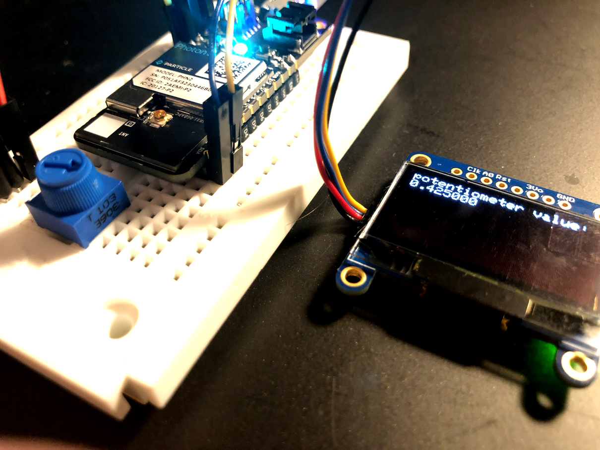
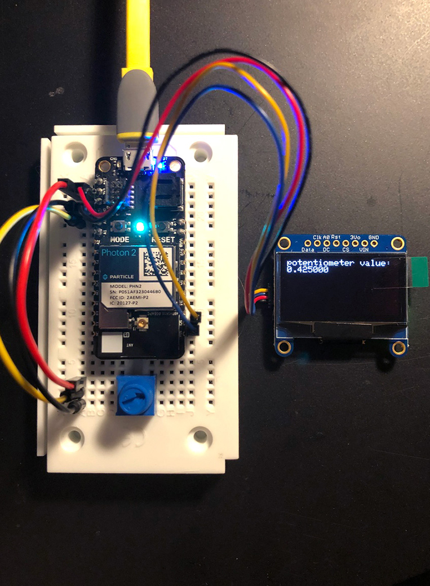
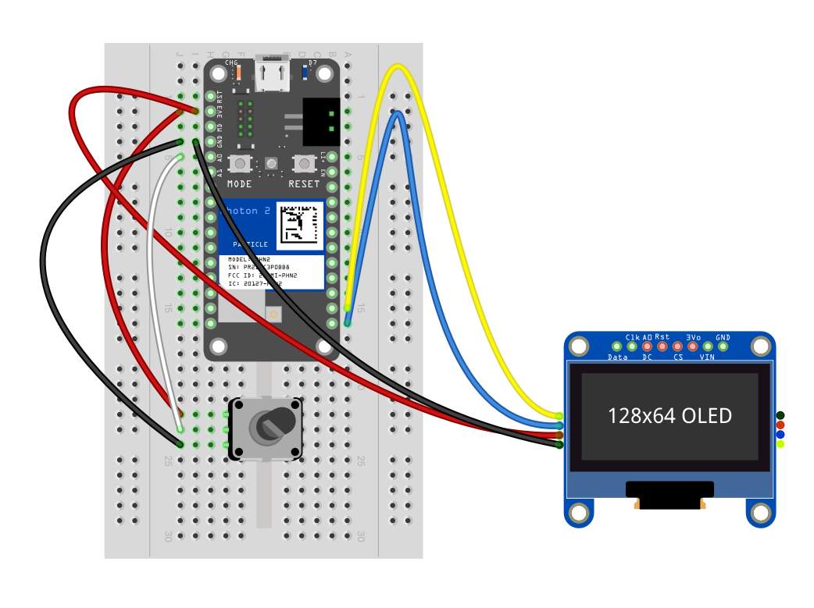

## potentiometer -> oled display



---

### Goal of Project 

*Display the value of a potentiometer on an OLED screen via the I2C bus on a Photon2*

This is an exercise in converting a raw analog voltage into human-readable text.  There are a few interesting tidbits along the way to pay attention to, including defining a custom function in Particle Workbench, utilizing a byte array for the display of a splash screen, and working with a variable (unknown) delay time for a particular piece of hardware (the oled).  We'll do a quick test in the `setup()` function to ascertain whether or not our OLED is functioning before we attempt o draw pixel data to it.  The two libraries you'll include in the project are `Adafruit_SSD1306.h` and `Adafruit_GFX.h`, the latter of which will aid in drawing text, shapes, and bitmaps.

#### This project demonstrates the following:

1. how to write code with the "Device OS" Particle.io operating system (microcontroller-based) that takes input, processes it, and passes the processed data to an output to yield actuation
1. how to connect a Monochrome 1.3" 128x64 OLED graphic display to our photon2 via a 4-pin JST connector cable (you can optionally wire soldered leads individually to the same pins of the microcontroller)  
1. how to use custom functions within DeviceOS
1. how to work with scheduled delays to perform desired outcomes
1. an intro to the `map()` function
1. type-casting in Wiring/C/C++
1. calling a library's primary object methods
1. nested for loops for drawing code

---

### Documentation: 

The circuit is powered over 3.3V from the microcontroller, which can be supplied via a usb power adapter, a lipo battery, or your computer's usb port.

pot/oled top | pot/oled fritzing
---|---
 | 

### Steps to recreate circuit:

Photon connections:

- push your Photon 2's pins into a mini (or regular) breadboard so that it straddles the two sides.  **Note** that one of the sides will have more pins left on the relevant rails than the other.  This is fine.  Also **note** that if you position the device towards the top of the board it's easier to plug in the micro-USB cable.  

OLED connections (note that the example uses a JST connector): 

1. connect the GND pin of the OLED to the GND pin of the photon2
1. connect the 3.3V pin of the OLED to the 3.3V pin of the photon2
1. connect the `Clk` (clock) pin of the OLED to the SCL pin of the photon2 (i2c) 
1. connect the `Data` pin of the OLED to the SDA pin of the photon2 (i2c)

Potentiometer connections:

1. connect the top pin of the potentiometer to the 3.3V pin of the photon2
1. connect the middle pin of the potentiometer to the first analog pin of the photon2 (A0)
1. connect the bottom pin of the potentiometer to the GND pin of the photon2

---

### Steps to replicate software environment

**Note:** *We assume that you have installed Particle Workbench inside of Visual Studio Code, and are familiar with the process of selecting your device.*  If not, see [this tutorial](https://github.com/Berkeley-MDes/tdf-fa23-equilet/blob/main/_pw_tutorial/_readme.md).

1. open the folder this README resides within in Visual Studio Code
1. select your particle device OS
1. select your particle device type
1. select your particle photon 2 device either by device name or ID
1. verify/compile
1. flash the code to your photon2 

#### Code (represented in project):

```
#include "Adafruit_SSD1306.h"
#include "Adafruit_GFX.h"
#include "splash.h" //this is our custom header containing the splash screen bitmap

SYSTEM_THREAD(ENABLED);

#define SCREEN_WIDTH 128 // OLED display width, in pixels
#define SCREEN_HEIGHT 64 // OLED display height, in pixels
#define SCREEN_ADDRESS 0x3D // OLED display address (for the 128x64)
#define POT_PIN A0 // Potentiometer is connected to A0

// Instantiate SSD1306 driver display object via I2C interface; note that no reset is used
Adafruit_SSD1306 disp(SCREEN_WIDTH, SCREEN_HEIGHT, &Wire, -1);

void draw_splash(void); //our splash screen function
float draw_potval(float val); //our potentiometer value display function
void draw_bitmap(const unsigned char* bitmap, int x, int y, int w, int h, int color);
int potval = 0;

void setup(){
  Serial.begin(9600);
  delay(8); 
  // if initialization fails print failure to Serial, and enter an infinite loop
  bool test_access = disp.begin(SSD1306_SWITCHCAPVCC, SCREEN_ADDRESS);

  if(!test_access){
    Serial.println(F("SSD1306 allocation failed"));
    for (;;); // Don't proceed, loop forever
  }else{
    Serial.println("SSD1306 allocation success");
    draw_splash();
    delay(2000);
  }
}

void loop(){
  int potval = map(analogRead(POT_PIN), 4095, 0, 0, 1000);
  float potval_float = (float)potval / 1000.0;

  Serial.printf("potval: %f\n", potval_float);
  draw_potval(potval_float);
  delay(200); // Pause for 1/10 second
}

void draw_splash(void){
  disp.clearDisplay();
  disp.drawBitmap(0, 0, epd_pirate_small, SCREEN_WIDTH, SCREEN_HEIGHT, WHITE);
  disp.display();
}

float draw_potval(float val){
  disp.clearDisplay();
  disp.setTextSize(1);
  disp.setTextColor(WHITE);
  disp.setCursor(0,0);
  disp.printf("potentiometer value: %f", val);
  disp.display();
  return val;
}

void draw_bitmap(const unsigned char* bitmap, int x, int y, int w, int h, int color) {
  int byte_width = (w + 7) / 8;
  for (int j = 0; j < h; j++) {
    for (int i = 0; i < w; i++ ) {
      if (pgm_read_byte(bitmap + j * byte_width + i / 8) & (128 >> (i & 7))) {
        disp.drawPixel(x + i, y + j, color);
      }
    }
  }
}
```

---

### To use/test

1. Turn the knob
1. Look at the OLED screen:  it should read `potentiometer value: <x>`
