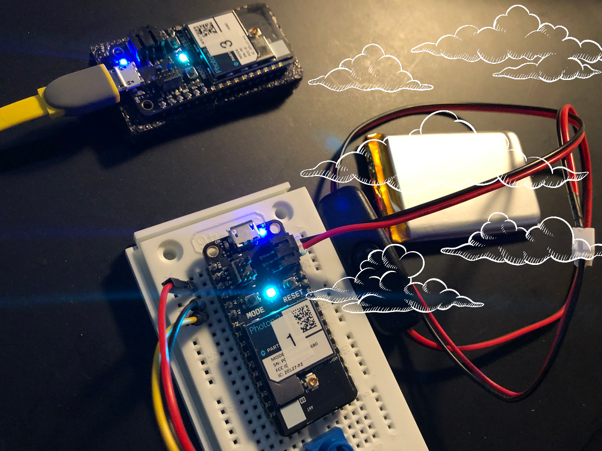
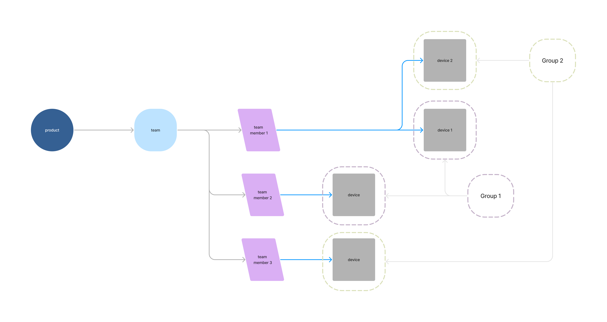
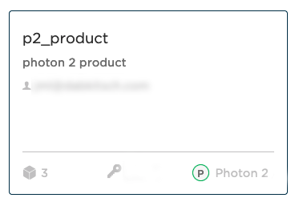
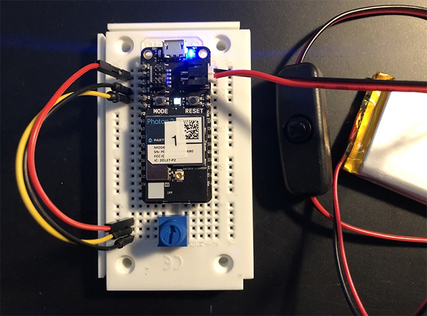
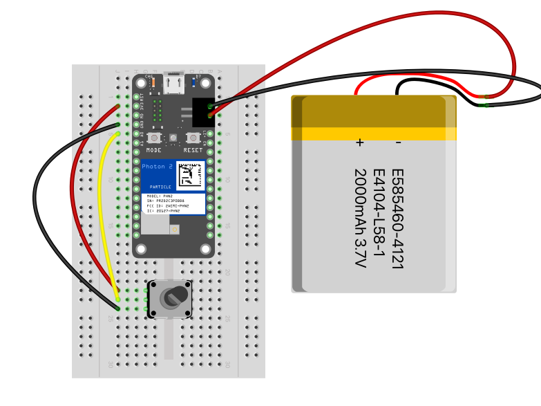
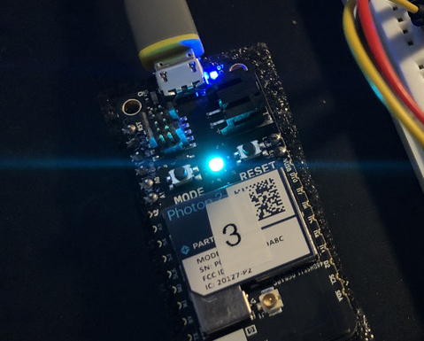

# Publish/Subscribe

A Particle Workbench project showcasing Particle.io's publish/subscribe cloud-based model

## [Publish to] -> [Subscribe from] _the particle cloud_



---

### Goal of Project 

*Publish a potentiometer's value (to the cloud) belonging to a specific photon, and subscribe to it with another photon.*

This is an exercise in enabling cloud communication between two microcontrollers via a Publish/Subscribe model.

#### This project demonstrates the following:

1. how to write code with the "Device OS" Particle.io operating system (microcontroller-based) that takes input, formats it, and passes the data to the cloud.  A secondary microcontroller can then pick up on this signal in the cloud, pull it down when notified of an update, and process it in order to formulate a physical output.  This particular series of operations demonstrates a 
1. how to use `Particle.publish()` and `Particle.subscribe()` within Particle's DeviceOS
1. a way to think about notifications and event-based operations across networks

---

### Particle.io console configuration:

**Same account:**

If you are subscribing to a device that is registered on your own account, the steps to make sure your published value can be seen by another `photon2` are

- navigate to [https://console.partile.io](https://console.partile.io)

- make a product 
<div></img></div>

- select product (click on the name), which brings you to the "product context" of the console

- select devices 
<div></img></div>

- add your `photon2`s to the product [add devices]
<div></img></div>

**Different accounts:**

If you are subscribing to a device that is **not** localized to your personal account (i.e, a classmate's or friend's), you will need to utilize a Particle.io team.  This is a multi-step process in which a product needs to be associated with a team.  Here is a diagram of what this looks like with respect to the nesting of elements (note that although groups are represented here you can forget about them for the moment):



...With that in mind, here are the steps to invite a team member and make sure it's located within the relevant product:

- make a product (skip if you've already got one)

  - go to [the particle console](https://console.particle.io/products), 
  and click [new product](https://console.particle.io/products/new)
  <div></img></div>
    - enter a name
    - give a description if applicable
    - in the device-type pulldown menu, select _Photon 2 / P2 (Wi-Fi)_

- select the product by name (the sidebar is reconfigured to show options for product configuration)
<div></img></div>

- select devices <div></img></div>
- add your `photon2` to the product [add devices]
<div></img></div>

- nav to team within the product 
<div></img></div>
  - invite the person via email to your team [invite team member]

---

### Circuit Documentation: 

The "publishing circuit" is powered over 3.3V from the microcontroller, which can be supplied via a usb power adapter, a lipo battery, or your computer's usb port.

**publisher unit (labeled with an ID):**

publish top | publish fritzing
---|---
 | 

**subscriber unit (labeled with an ID):**



### Steps to recreate the circuit:

Photon connections (for the publishing unit):

- push your Photon 2's pins into a mini (or regular) breadboard so that it straddles the two sides.  **Note** that one of the sides will have more pins left on the relevant rails than the other.  This is fine.  Also **note** that if you position the device towards the top of the board it's easier to plug in the micro-USB cable.  

Potentiometer connections (based on diagram orientation):

1. connect the top pin of the potentiometer to the 3.3V pin of the `photon2`
1. connect the middle pin of the potentiometer to the first analog pin of the `photon2` (A0)
1. connect the bottom pin of the potentiometer to the GND pin of the photon2

---

### Steps to replicate software environment

**Note:** *We assume that you have installed Particle Workbench inside of Visual Studio Code, and are familiar with the process of selecting your device.*  If not, see [this tutorial](https://github.com/Berkeley-MDes/tdf-fa23-equilet/blob/main/_pw_tutorial/_readme.md).

1. open the folder this README resides within in Visual Studio Code
1. select your particle device OS
1. select your particle device type
1. select your particle photon 2 device either by device name or ID
1. verify/compile
1. flash the code to your `photon2` 

#### Code (publish project):

```
double floatval = 0.0;
#define POTPIN = A0;
// setup() runs once, when the device is first turned on.
void setup() {
    pinMode(A0, INPUT);
}

// loop() runs over and over again, as quickly as it can execute.
void loop() {
    floatval = analogRead(A0);
    Particle.publish("photoLed", String(floatval), PRIVATE);
    Serial.printf("the published value: %f\n", floatval);
    delay(5000);
}
```
#### Code (subscribe project):

```
SYSTEM_THREAD(ENABLED);
//function definitions
void photoLedHandler(const char *event, const char *data);
//vars
double floatval = 0.0;

// setup() runs once, when the device is first turned on.
void setup() {
 // Particle.variable("myfloat", &floatval, DOUBLE);
  Particle.subscribe("photoLed", photoLedHandler);
  Serial.begin(9600);
}

void photoLedHandler(const char *event, const char *data){
  Serial.printf("the raw data event: %s\n", data);
  float myvalue = (float)(atof(data));
  Serial.printf("the converted value: %f\n", myvalue);   
}

// nothing in our loop!
void loop() {
}
```

---

### To use/test

1. Turn the knob on the `photon2` designated as the publisher 
1. Look in the serial monitor (make sure you've selected a port in the monitor window as well as enabling monitoring) for values that are captured over the cloud!
